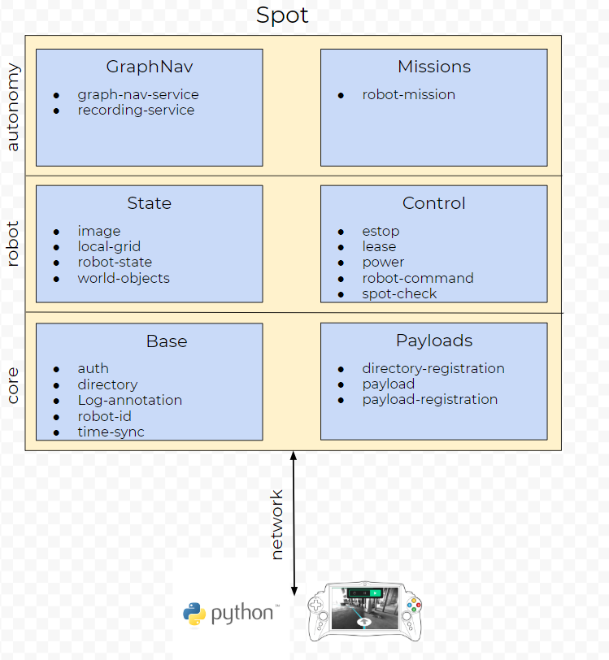

<!--
Copyright (c) 2020 Boston Dynamics, Inc.  All rights reserved.

Downloading, reproducing, distributing or otherwise using the SDK Software
is subject to the terms and conditions of the Boston Dynamics Software
Development Kit License (20191101-BDSDK-SL).
-->

# [Spot SDK](../../README.md) > Concepts

The Spot API lets applications control Spot, read sensor information, and create and integrate payloads. The Spot API follows a client-server model, where client applications communicate to services running on Spot over a network connection. The following diagram provides the high-level overview of the components involved.

The client applications (shown at the bottom) can run on tablets, laptops, the cloud, or even on payloads connected to Spot, as long as they can establish a network connection to Spot. The network connection can be any IP network - a direct WiFi or ethernet connection to the robot, intranet, or even the Internet. Spot implements the API as a variety of network services, such as the “image” service or the “robot-command” service. Higher layers of the service stack - such as autonomy services - are built on top of services at the lower layer of the stack. Finally, payloads allow for expansion of services beyond those provided by Spot itself - for example, Spot CAM offers a variety of services to control stream quality or the LED lights.

The following documents cover the API architecture in more detail:
* [About Spot](about_spot.md). The physical concepts behind Spot.
* [Networking](networking.md). The network layer that the API is built on top of.
* [Base services](base_services.md). Base services which provide key infrastructure for the API.
* [Geometry and Frames](geometry_and_frames.md). How the API represents geometry and coordinate frames.
* [State services](state_services.md). Retrieiving state and sensor information from Spot.
* [Autonomy services](autonomy/README.md). Higher-level navigation, localization, and missions.
