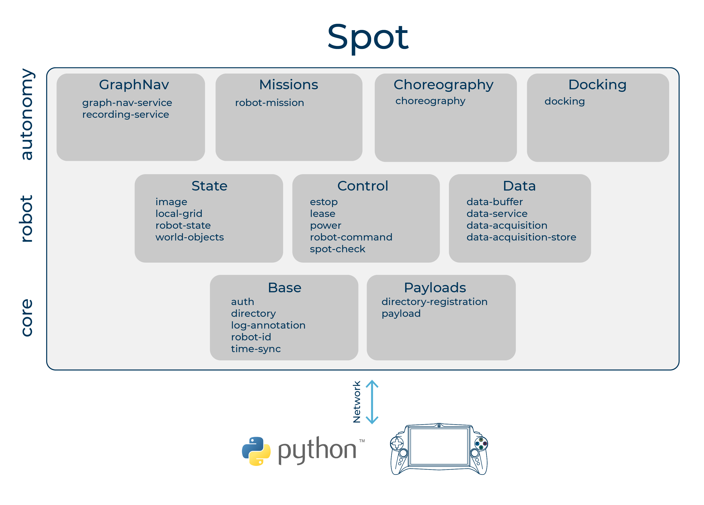

<!--
Copyright (c) 2020 Boston Dynamics, Inc.  All rights reserved.

Downloading, reproducing, distributing or otherwise using the SDK Software
is subject to the terms and conditions of the Boston Dynamics Software
Development Kit License (20191101-BDSDK-SL).
-->

<b>The Spot SDK documentation is best viewed via our developer site at <a href="https://dev.bostondynamics.com">dev.bostondynamics.com</a>. </b>

# Concepts

## Spot API

The Spot API lets applications control Spot, read sensor information, and create and integrate payloads. The Spot API follows a client-server model, where client applications communicate with services running on Spot over a network connection. The following diagram provides the high-level overview of the robot's services.

Client applications can run on tablets, laptops, cloud-based applications, or payloads connected to Spot, as long as they can establish a network connection to Spot. The network connection can be any IP network, such as a direct WiFi or ethernet connection to the robot, intranet, or the Internet.

Spot implements the API as a variety of network services, such as the image service or the robot-command service. Higher layers of the service stack, such as autonomy services, are built on top of services at the lower layer of the stack, the core services.

Finally, payloads allow for expansion of services beyond those provided by Spot itself. For example, Spot CAM offers a variety of services to control stream quality or the LED lights.

## Contents

* [About Spot](about_spot.md)
* [Networking](networking.md)
* [Base services](base_services.md)
* [Geometry and Frames](geometry_and_frames.md)
* [Robot services](robot_services.md)
* [E-Stop](estop_service.md)
* [Autonomy services](autonomy/README.md)
